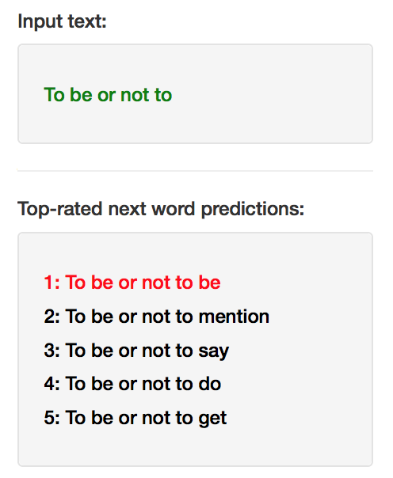
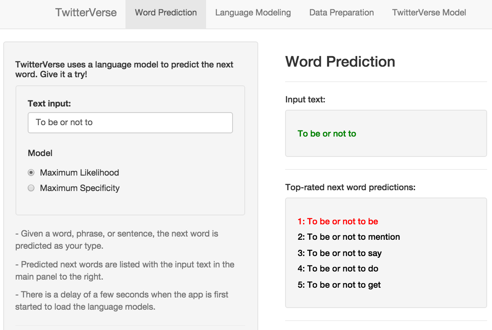

TwitterVerse Word Prediction
========================================================
css: jaystyle.css
author: Jay Urbain, January 16, 2016

Objective:
- From a collection of blogs, news articles, and Twitter data, develop a language model for next word prediction.
- Develop an interactive tool that given a word, phrase, or sentence, uses the language model to predict the next word.

References:
- Katz, S. M. (1987). Estimation of probabilities from sparse data for the language model component of a speech recogniser. IEEE Transactions on Acoustics, Speech, and Signal Processing, 35(3), 400–401.
- Manning and Schütze, Foundations of Statistical Natural Language Processing, MIT Press (1999), ISBN 978-0-262-13360-9.
- Hornik, K. (2008). Journal of Statistical Software, 25(5).
- Körner, M. C. Implementation of Modified Kneser-Ney Smoothing on Top of Generalized Language Models for Next Word Prediction Bachelorarbeit, (September 2013).
- [Coursera course on NLP](https://class.coursera.org/nlp)

Language Modeling
========================================================
left: 60%
 
 
The goal of language modeling is to compute the probability of a sentence or sequence of words:

$$p(W) = p(w_1,w_2,...,w_n)$$

A related task, **word prediction,** involves determining the probability of an upcoming word. E.g., given a trigram, a sequence of **3** words, predict the **4^th** word:

$$p(W) = p(w_4|w_1,w_2,w_3)$$

Top performing language models estimate the conditional probability of a word given its history in the n-gram by either:
- "**backing-off**" to models with smaller histories when larger histories are not available. E.g., Stupid backoff, Katz Backoff, Kneser-Neys Backoff.
- "**interpolating**" models with smaller histories. E.g., Absolute discounting, modified interpolated Kneser-Neys.

A significant feature of language models include **smoothing** probability estimates to account for low-frequency or unseen ngrams (**data sparsity).**

Advanced methods include word co-occurence statistics, novel contribution, and the specificity of the next word given the preceding ngram.

***
**TwitterVerse Word Prediction**

Model Development: Data Preparation
========================================================
Model data is taken from the [HC Corpora](http://www.corpora.heliohost.org/aboutcorpus.html) which consists blogs, news and twitter items.

Only English data was used, which consisted of a total of: 4,269,678 items, and 103,366,192 words. Approximately 42% news, 35% blogs, and 13% twitter.

10% of the news, 10% of the blogs, and 10% of the twitter data was randomly sampled to create a development data set of approximately 470,000 items.

A corpus was created from words after removing punctuation, numbers, and extra white space; and converting to lower case.

From the corpus, quadgram, trigram, bigram, and unigram term-document matrices were created for aggregating counts.

From the term-document matrices, data frames were created with counts and statistics for implementing our model.

Model Development: Language Model
========================================================

Our language model is based on the **Katz Backoff** model. It is one of the top performing language models for small data sets, and it is also very efficient. This efficiency allowed us to create a quad-gram backoff model, and add our own extension to the model based on word specificity.

$$
P_{bo}(w_i|w_{i-n+1}...w_{i-1})=\left\{
                \begin{array}{ll}
                  d_{w_i-n+1...w_i} \frac{C(w_{i-n+1}... w_{i-1}w_i)}{C(w_{i-n+1}... w_{i-1})}, \space for \space C(w_{i-n+1}... w_{i-1}w_i) > 1\\
\alpha_{w_i-n+1...w_i}P_{bo}(w_i|w_{i-n+2}...w_{i-1} \space otherwise
                \end{array}
              \right.
$$

The model backs off to smaller histories when larger histories are not available, and orders results based on the **maximum likelihood** of candidate **ngrams.**

In our application, we identify up to $10$ candidate word predictions by first selecting the most likely quadgram predictions from trigrams, trigrams from bigrams, and bigrams from unigrams. This is essentially the $d_{w_i-n+1...w_i}$ term in the model. $\alpha=1$ in all cases.

We also added an option to resort the top $10$ candidate word predictions by word specificity.

We define word specificy as the likelihood of the **predicted word** to occur with the preceeding **ngram** relative to all other **ngrams** the word can occur with.

TwitterVerse Word Prediction
========================================================
TwitterVerse Word Prediction is available as a Shiny App: [https://jayurbain.shinyapps.io/TwitterVerse/](https://jayurbain.shinyapps.io/TwitterVerse/)

* Simply enter a word, phrase, or sentence, and TwitterVerse will predict the next word.
* Additional tabs provide an explanation of language modeling, data preparation, and our TwitterVerse Language Model.

The TwitterVerse is available on GitHub: [https://github.com/jayurbain/TwitterVerse](https://github.com/jayurbain/TwitterVerse)

